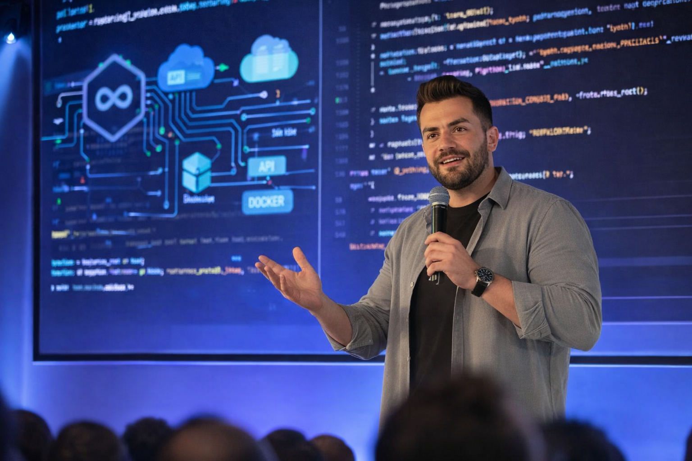

## About

A digital laboratory is a living ecosystem — where unfinished ideas are not flaws but seeds,
where code is not static but fluid,  and where every experiment carries the potential to 
reshape tomorrow.  

  > *Innovation is not built in comfort—it is forged in the rhythm of breaking and rebuilding stronger.*

Frameworks here are not just technical scaffolds; they are foundations for collaboration. 
Plugins are not mere extensions; they are bridges between imagination and utility. Packages 
are not isolated tools; they are vessels of shared knowledge, designed to travel across 
borders and inspire new creations.  

- Every commit is a declaration: *this is possible*.  
- Every prototype is a rehearsal: *this can grow*.  
- Every collaboration is a spark: *this will endure*.  

This laboratory thrives on iteration—imagining, testing, breaking, and rebuilding stronger. 
It is a place where curiosity becomes invention, where knowledge flows like electricity, 
and where the rhythm of builders and dreamers composes a symphony of progress.  

Step inside, and you don’t just witness creation—you become part of it. 

## Projects

- [**Forge**](https://selcukcukur.me) - My digital workshop — a living lab for ideas, experiments, and open-source creations.

## Contact

I try to actively use all social media accounts as much as I can, if you want to communicate about anything, you can 
contact me without any hesitation.

